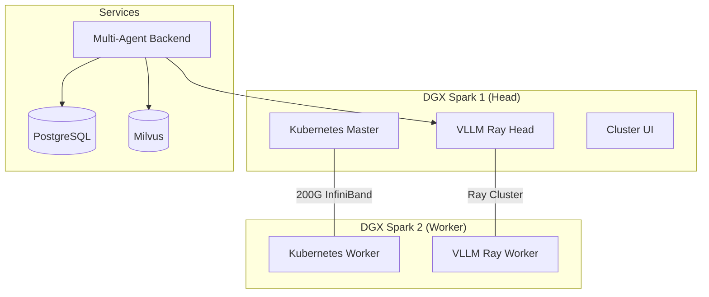

# Unified DGX Spark Multi-Agent VLLM Deployment

## Overview

This unified deployment system consolidates the separate DGX Spark configurations into a single, comprehensive installation that deploys a **VLLM-based multi-agent system** across **2 DGX Spark nodes**:

- **Kubernetes cluster** with InfiniBand fabric networking (200Gbps)
- **VLLM model serving** with Ray distributed inference across both nodes
- **Multi-agent chatbot** with Swarm-style orchestration:
  - **Supervisor Agent** - Routes requests to specialized agents
  - **RAG Agent** - Knowledge retrieval and document search
  - **Coding Agent** - Code generation, debugging, and development (based on autonomous-coding patterns)
  - **Image Understanding Agent** - Visual analysis and multimodal tasks
- **Multi-modal inference** capabilities (text, image, code generation)
- **Unified management interface** for monitoring and control

## Quick Start

### Prerequisites

- 2 DGX Spark systems with NVIDIA H100/A100 GPUs
- Ubuntu 22.04+ with CUDA drivers installed
- Network connectivity between DGX Sparks (LAN + optional InfiniBand)
- Sufficient storage space for models and data

### Installation

1. **Configure your environment**:
   ```bash
   cp unified-config.env unified-config.local.env
   # Edit unified-config.local.env with your network settings
   ```

2. **Deploy the complete stack**:
   ```bash
   ./deploy-unified.sh
   ```

3. **Monitor deployment progress**:
   ```bash
   ./deploy-unified.sh status
   ```

## Multi-Agent System

### Agent Architecture

The multi-agent system uses **Swarm-style orchestration** where a supervisor agent routes requests to specialized agents:

```
┌─────────────────────────────────────────────────────────────┐
│                      User Request                           │
└─────────────────────────┬───────────────────────────────────┘
                          │
                          ▼
┌─────────────────────────────────────────────────────────────┐
│                   Supervisor Agent                          │
│  Model: gpt-oss-120b                                        │
│  • Analyzes request intent                                  │
│  • Routes to specialized agent                              │
│  • Coordinates multi-agent tasks                            │
└─────────────────────────┬───────────────────────────────────┘
                          │
          ┌───────────────┼───────────────┐
          │               │               │
          ▼               ▼               ▼
┌─────────────┐   ┌─────────────┐   ┌─────────────┐
│  RAG Agent  │   │Coding Agent │   │ Image Agent │
│ gpt-oss-20b │   │ Llama-3.1-8B│   │   Phi-4     │
│             │   │             │   │             │
│ • Search    │   │ • Generate  │   │ • Analyze   │
│ • Retrieve  │   │ • Debug     │   │ • OCR       │
│ • Summarize │   │ • Test      │   │ • Describe  │
└─────────────┘   └─────────────┘   └─────────────┘
```

### Available Agents

| Agent | Model | Capabilities |
|-------|-------|--------------|
| **Supervisor** | `gpt-oss-120b` | Request routing, coordination, general assistance |
| **RAG Agent** | `gpt-oss-20b` | Knowledge retrieval, document search, Q&A with citations |
| **Coding Agent** | `Llama-3.1-8B-Instruct` | Code generation, debugging, testing, code review |
| **Image Agent** | `Phi-4` | Image analysis, OCR, visual Q&A |

### Coding Agent Features

The Coding Agent is based on patterns from `claude-quickstarts/autonomous-coding` and provides:

**Capabilities:**
- Code generation in Python, JavaScript, TypeScript, Go, Rust, Java, C/C++, Bash
- Code execution in sandboxed environment
- Static code analysis
- Unit test generation
- Code explanation and documentation
- File management in workspace

**Available Tools:**
- `execute_code(code, language)` - Run code safely
- `analyze_code(code, language)` - Static analysis
- `search_code_patterns(query, language)` - Find patterns
- `generate_tests(code, language)` - Create unit tests
- `write_file(filename, content)` - Write to workspace
- `read_file(filename)` - Read from workspace
- `list_files(directory)` - List workspace files

## Configuration

### Key Configuration Files

| File | Purpose | Description |
|------|---------|-------------|
| `unified-config.env` | Main configuration | Network, models, resource settings |
| `unified-config.local.env` | Local overrides | User-specific settings (gitignored) |
| `unified-deployments/` | Kubernetes manifests | Declarative service definitions |
| `unified-deployments/multi-agent/` | Multi-agent package | Python package with Swarm implementation |

### Network Configuration

```bash
# Control plane (LAN access)
CONTROL_PLANE_API_IP=192.168.86.50
CONTROL_PLANE_INTERFACE=enp65s0

# High-speed fabric (InfiniBand)
FABRIC_CTRL_IP=10.10.10.1
FABRIC_CTRL_INTERFACE=enP7s7

# Worker node
WORKER_NODE_IP=10.10.10.2
WORKER_NODE_SSH_TARGET=192.168.86.39
```

### Model Configuration

```bash
# Primary model for supervisor agent
MODEL="openai/gpt-oss-120b"

# Agent-specific models
SUPERVISOR_MODEL="gpt-oss-120b"
RAG_MODEL="gpt-oss-20b"
CODING_MODEL="meta-llama/Llama-3.1-8B-Instruct"
IMAGE_MODEL="microsoft/Phi-4"

# Distributed serving settings
TENSOR_PARALLEL=2
GPU_MEMORY_UTIL=0.90
MAX_MODEL_LEN=8192
```

## Architecture

### Component Overview



### Kubernetes Namespaces

| Namespace | Components | Purpose |
|-----------|------------|---------|
| `vllm-system` | VLLM Ray head/workers, model cache | Model serving infrastructure |
| `agents-system` | Agent backend, PostgreSQL, Milvus | Multi-agent chatbot services |
| `multimodal-system` | ComfyUI, image generation | Multi-modal inference |
| `monitoring-system` | Prometheus, Grafana | Observability stack |

### Storage Architecture

| Volume | Size | Purpose | Mount Path |
|--------|------|---------|------------|
| `hf-cache` | 500Gi | HuggingFace model cache | `/raid/hf-cache` |
| `model-cache` | 1Ti | Additional model storage | `/raid/model-cache` |
| `agent-data` | 100Gi | Agent conversations, state | `/raid/agent-data` |

## Usage

### Management Interfaces

| Service | URL | Purpose |
|---------|-----|---------|
| Enhanced Cluster UI | `http://<head-ip>:5000` | Unified monitoring dashboard |
| VLLM API | `http://<head-ip>:8000` | OpenAI-compatible API |
| Ray Dashboard | `http://<head-ip>:8265` | Distributed serving monitoring |
| Agent Backend | `http://<head-ip>:8000` (agents-system) | Multi-agent API |

### API Usage Examples

#### Multi-Agent Chat (Supervisor Routing)

```bash
# Let supervisor route to appropriate agent
curl -X POST "http://<head-ip>:8000/chat" \
  -H "Content-Type: application/json" \
  -d '{
    "message": "Write a Python function to calculate fibonacci numbers",
    "session_id": "user123"
  }'
```

#### Direct Agent Access

```bash
# Direct to coding agent
curl -X POST "http://<head-ip>:8000/chat" \
  -H "Content-Type: application/json" \
  -d '{
    "message": "Debug this code: def foo(): return bar",
    "agent_type": "coding",
    "session_id": "user123"
  }'

# Direct to RAG agent
curl -X POST "http://<head-ip>:8000/chat" \
  -H "Content-Type: application/json" \
  -d '{
    "message": "Search for documentation about Kubernetes deployments",
    "agent_type": "rag",
    "session_id": "user123"
  }'
```

#### List Available Agents

```bash
curl "http://<head-ip>:8000/agents"
```

#### VLLM Direct Inference

```bash
curl -X POST "http://<head-ip>:8000/v1/chat/completions" \
  -H "Content-Type: application/json" \
  -d '{
    "model": "gpt-oss-120b",
    "messages": [
      {"role": "user", "content": "Explain quantum computing"}
    ],
    "max_tokens": 1000
  }'
```

### Kubectl Operations

```bash
# Check all pods
kubectl get pods --all-namespaces

# Monitor VLLM logs
kubectl logs -f deployment/vllm-ray-head -n vllm-system

# Monitor agent backend logs
kubectl logs -f deployment/agent-backend -n agents-system

# Check GPU allocation
kubectl describe nodes | grep nvidia.com/gpu

# Scale agent backend
kubectl scale deployment agent-backend --replicas=3 -n agents-system
```

## Troubleshooting

### Common Issues

#### VLLM Service Not Starting

1. **Check GPU availability:**
   ```bash
   kubectl describe nodes | grep nvidia.com/gpu
   nvidia-smi
   ```

2. **Verify model download:**
   ```bash
   kubectl logs deployment/vllm-ray-head -n vllm-system
   ```

3. **Check HuggingFace token:**
   ```bash
   kubectl get secret hf-token -n vllm-system -o yaml
   ```

#### Agent Backend Connection Errors

1. **Verify VLLM service endpoint:**
   ```bash
   kubectl get svc vllm-service -n vllm-system
   kubectl exec -it deployment/agent-backend -n agents-system -- \
     curl http://vllm-service.vllm-system.svc.cluster.local:8000/health
   ```

2. **Check agent backend health:**
   ```bash
   kubectl logs deployment/agent-backend -n agents-system
   ```

### Performance Tuning

```bash
# Adjust GPU memory utilization
kubectl patch configmap vllm-config -n vllm-system --patch '{
  "data": {
    "gpu_memory_util": "0.85"
  }
}'
kubectl rollout restart deployment/vllm-ray-head -n vllm-system
```

## Development

### Local Testing

```bash
# Test configuration without deployment
./deploy-unified.sh --dry-run

# Deploy only specific components
ENABLE_VLLM=1 ENABLE_MULTI_AGENT=0 ./deploy-unified.sh
```

### Adding New Agent Types

1. Create agent in `unified-deployments/multi-agent/multi_agent/agents/`
2. Register in `agents/__init__.py`
3. Add to supervisor's routing functions
4. Update ConfigMap with model assignment

### Multi-Agent Package Development

```bash
cd unified-deployments/multi-agent

# Install for development
pip install -e ".[dev]"

# Run tests
pytest tests/

# Run locally
VLLM_ENDPOINT="http://localhost:8000/v1" python -m multi_agent.server
```

## Project Structure

```
unified-deployments/
├── agents/
│   └── agents-deployment.yaml    # K8s deployment with embedded multi-agent code
├── vllm/
│   └── vllm-deployment.yaml      # VLLM Ray cluster deployment
├── storage-pvcs.yaml             # Persistent volume claims
├── cluster-ui-enhanced.py        # Enhanced monitoring UI
└── multi-agent/                  # Python package (for local dev)
    ├── pyproject.toml
    ├── Dockerfile
    └── multi_agent/
        ├── core.py               # Swarm implementation
        ├── server.py             # FastAPI server
        └── agents/
            ├── supervisor.py     # Supervisor agent
            ├── rag.py            # RAG agent
            ├── coding.py         # Coding agent
            └── image_understanding.py
```

## Contributing

See individual component documentation:
- [DGX Spark Toolkit](./dgx-spark-toolkit/README.md)
- [VLLM DGX Spark](./vllm-dgx-spark/README.md)
- [Multi-Agent Package](./unified-deployments/multi-agent/README.md)

## License

See individual component licenses in their respective directories.\n